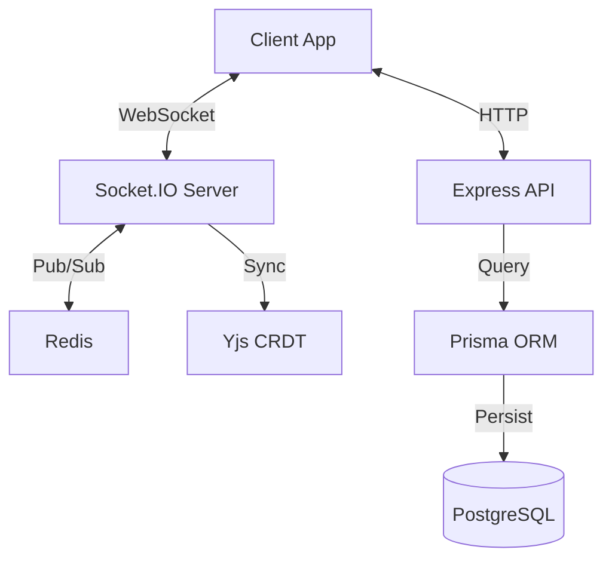

# 🚀 Unison - Real-Time Collaboration Platform


Unison is a powerful, scalable backend for real-time document collaboration. Built with performance and reliability in mind, it leverages **Socket.IO** and **Yjs** for conflict-free replicated data types (CRDTs), ensuring seamless multi-user editing experiences.

## ✨ Features

- 🔄 **Real-time Collaboration**: Instant updates with Socket.IO and Yjs CRDT.
- 🔐 **Secure Authentication**: JWT-based auth with Passport.js (Google/GitHub OAuth support).
- 🗄️ **Robust Database**: PostgreSQL managed via Prisma ORM.
- ⚡ **High Performance**: Redis caching and Pub/Sub for horizontal scaling.
- 🛡️ **Security First**: Rate limiting, input validation (Zod), and secure headers.
- 🐳 **Docker Ready**: Full containerization support for easy deployment.
- 📝 **Type Safety**: 100% TypeScript codebase.

## 🛠️ Tech Stack

| Category | Technology | Description |
|----------|------------|-------------|
| **Runtime** |  | JavaScript runtime environment |
| **Framework** |  | Web framework for Node.js |
| **Language** |  | Typed superset of JavaScript |
| **Database** |  | Relational database system |
| **ORM** |  | Next-generation ORM |
| **Caching** |  | In-memory data structure store |
| **Real-time** |  | Real-time event-based communication |

## 🚀 Quick Start

### Prerequisites

- Node.js v18+
- PostgreSQL database
- Redis server
- npm or yarn

### Installation

1. **Clone the repository:**
   ```bash
   git clone https://github.com/ellay21/Unison.git
   cd Unison
   ```

2. **Install dependencies:**
   ```bash
   npm install
   ```

3. **Configure environment:**
   ```bash
   cp .env.example .env
   # Update .env with your database and redis credentials
   ```

4. **Initialize database:**
   ```bash
   npx prisma db push
   npx prisma generate
   ```

5. **Start the server:**
   ```bash
   npm run dev
   ```

The server will start on `http://localhost:3000`.

## 🐳 Docker Deployment

1. **Build the image:**
   ```bash
   docker build -t unison-backend .
   ```

2. **Run the container:**
   ```bash
   docker run -p 3000:3000 --env-file .env unison-backend
   ```

## 📚 API Documentation

The API is fully documented using `.http` files for easy testing.

- **`api-docs.http`**: Detailed API endpoint descriptions.
- **`api-test.http`**: Ready-to-use requests for testing all endpoints.

### Key Endpoints

| Method | Endpoint | Description |
|--------|----------|-------------|
| `POST` | `/api/auth/register` | Register a new user |
| `POST` | `/api/auth/login` | Login and receive JWT |
| `GET` | `/api/documents` | List user documents |
| `POST` | `/api/documents` | Create a new document |
| `WS` | `document:join` | Join a collaboration session |

## 🏗️ Architecture



## 🤝 Contributing

Contributions are welcome! Please feel free to submit a Pull Request.

1. Fork the project
2. Create your feature branch (`git checkout -b feature/AmazingFeature`)
3. Commit your changes (`git commit -m 'Add some AmazingFeature'`)
4. Push to the branch (`git push origin feature/AmazingFeature`)
5. Open a Pull Request

## 📄 License

Distributed under the MIT License. See `LICENSE` for more information.

